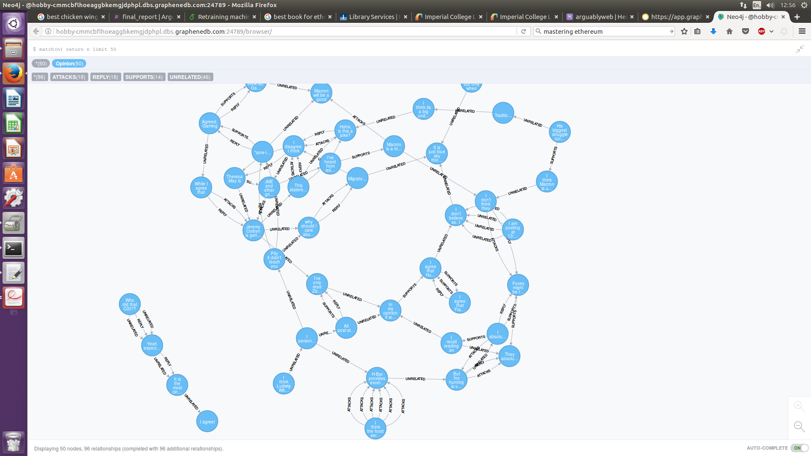

# Arguably
Argumentation mining is an important part of natural language processing, which is in turn, an important part of artificial intelligence. 
Argumentation mining can be briefly summarised as the process of using artificial intelligence to automatically identify arguments and their structure within text. 
Artificial intelligence, in particular machine learning, is only as good as the data used during the training process. Argumentation mining is no different. 
In order to provide this training data in a clean and applicable format, a web application has been constructed for the task. 
The website provides a platform for user debate via a clean and intuitive interface. 
A graphical database, Neo4j, is used to record three relations between arguments, *attacks*, *supports* and *unrelated*. 
The data, per topic and overall, is readily available for download, facilitating offline training for argumentation mining classifiers. 

To set up this project: 
1. Clone the github to location of your choice. 
2. Set up Neo4j locally or from a PaaS such as Graphene. Link the URL of the database in server.js
3. NPM install in the main directory. 
4. Run with nodemon server.js or node server.js.
5. Website should be accessible on http://localhost:8080
6. Get users to use website, then download the produced data and retrain ML algorithm offline.

The information is gathered in Neo4j in the following style:

